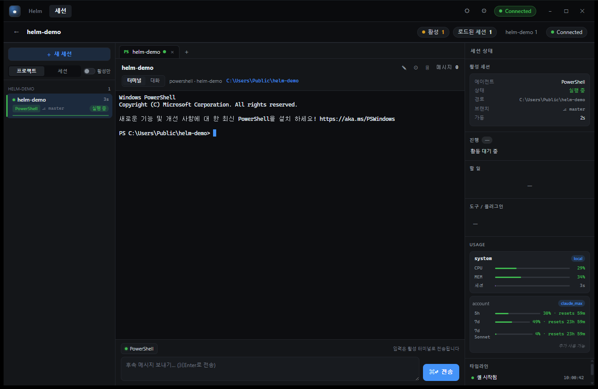

<div align="center">

# ⎈ Helm

**A lightweight, native, cross-platform dashboard-terminal that harmonizes with AI coding agent CLIs.**

Run Claude Code, Codex, or opencode inside Helm's terminals — and the dashboard
surfaces each session's live state (progress, tasks, tools, plugins, token
context) right beside the terminal. tmux/cmux for the agent era.

<sub>`Tauri (Rust)` · `WebView2 / WKWebView / WebKitGTK` · `ConPTY / PTY` · `xterm.js + WebGL` · no Electron</sub>

**English** · [한국어](README.ko.md)



</div>

---

## Why

Modern coding agents are CLIs with rich, structured output — task lists, tool
calls, token budgets, multi-step plans. A plain terminal flattens all of that
into a scrollback of text.

Helm runs the agent in a **real terminal** (so everything works exactly as it
does in your shell) **and**, in parallel, reconstructs that structure as a
**live dashboard** — without the agent knowing or caring. One window, many
agents, full situational awareness.

When an agent supports it, Helm registers a **native hook** so state pushes the
instant it changes — no polling. When it doesn't (or the hook goes quiet), Helm
reads the agent's own session logs on filesystem-event wake. Either way the
dashboard stays live.

## What you get

A three-pane dashboard:

| Pane | Shows |
|---|---|
| **Left** | Every session, grouped by project, with a status dot and a live activity bar. New sessions launch into a working folder you pick (path input or native folder browse). |
| **Center** | Session tabs (per-agent icon, attention ring) + the live terminal, with a **Terminal ⇄ Conversation** toggle that re-renders the transcript as message cards, and a composer with model / agent / reasoning quick controls. |
| **Right** | The active session's live state — progress, tasks, tools/plugins, token context — plus a per-session event timeline and live system CPU/MEM. |

## Features

| Feature | What it does |
|---|---|
| **Instant native hooks** | Each supported agent registers a hook that POSTs lifecycle events (tool start/finish, task changes, turn completion) to a localhost receiver — state updates the instant it happens, zero polling. Registration is additive and never disturbs the agent's own config or trust store. |
| **Granular live progress** | Right rail and tasks board show the current sub-step: the running tool with its target file/command, the highlighted in-progress task, and a step counter (e.g. `4/8`) — for Claude, Codex, and opencode. |
| **Tasks board** | One card per running session: status, live activity, a per-second elapsed timer, and a context-usage bar, with the full task list below. |
| **Conversation view** | Re-renders the transcript as message cards — user/assistant/system roles, collapsible reasoning, tool calls with expandable results. |
| **Image lightbox + copy** | Images in messages render as thumbnails; click to open a lightbox (zoom, arrow-key nav, Esc / click-out to close). Copy buttons on each message (text), each code block (code), and each image. |
| **Composer quick controls** | Model / agent / reasoning chips above the send button. Claude's model list (Default, Opus, Opus Plan, Sonnet, Haiku) switches in one click via `/model <name>`; opencode switches via live API; Codex opens its native picker. |
| **Real model/agent switching (opencode)** | Helm launches opencode on a free localhost port, reads its live model/agent lists from the API, and posts the selected `{model, agent}` with your next message — opencode persists them. Falls back to the native picker on API failure. |
| **Completed-plan one-click execute** | When an agent finishes a plan, it appears under the Plans tab; click ▶ and that agent implements it directly — no separate start-work step. |
| **Claude account auto-switch** | When a Claude session's context crosses a threshold at a turn boundary, Helm swaps to the next configured account profile (after backing up the current credentials) and resumes with `--continue`. Gated and opt-in (see below). |
| **Mobile LAN access** | The 📱 button surfaces a URL for any phone on the same Wi-Fi; the phone drives sessions live over HTTP + WebSocket. |
| **Image paste** | `Ctrl/Cmd`+`V` with an image in the clipboard saves a temp PNG and pastes its path, so agents like Claude Code / opencode attach it. |
| **Windows-Terminal-style clipboard** | `Ctrl/Cmd`+`V` / `Shift`+`Insert` paste; `Ctrl`+`Shift`+`C` / `Cmd`+`C` copy selection; `Ctrl`+`C` with no selection interrupts the agent. Bracketed-paste safe. |
| **Session auto-restore** | Working dir + agent + PTY state persist across restart and reboot; Claude resumes with `--continue`. |
| **Settings** | Terminal font, cursor blink, default agent, panel visibility, restore toggle, per-agent options — persisted to localStorage, applied live. |
| **WebGL terminal** | xterm.js renders glyphs on the GPU (DOM fallback) for snappy, live-echo interaction. |

## Agent support

| Capability | Claude Code | Codex | opencode |
|---|:---:|:---:|:---:|
| Detection + labeling | ✓ (script or interactive) | ✓ (title + log) | ✓ (title + log) |
| Status / activity | ✓ hook + transcript | ✓ hook + log | ✓ hook + log + DB |
| Granular sub-step (tool + target) | ✓ | ✓ | ✓ |
| Tasks / todos | ✓ (TodoWrite) | ✓ (`update_plan`) | ✓ (DB tasks) |
| Tools / plugins | ✓ (MCP) | ✓ (timeline) | ✓ (MCP + plugins) |
| Conversation view | ✓ full fidelity | ✓ full fidelity | ✓ ¹ (DB-reconstructed) |
| Reasoning (thinking) | ✓ collapsible | ✓ collapsible | ✓ collapsible |
| Tool calls in messages | ✓ with results | ✓ with results | ✓ with results |
| Images in messages | ✓ lightbox + copy | ✓ lightbox + copy | ✓ lightbox + copy |
| Token context | ✓ | ✓ | ✓ ² (DB, offline fallback) |
| Current mode/model | — | — | ✓ (mode + model chips) |
| Real model/agent switch | ✓ `/model` (one-click) | — (native picker) | ✓ ³ HTTP API (one-click) |
| Plan detection + execute | ✓ (ExitPlanMode) | ✓ (`update_plan`) | ✓ (plan mode) |
| Instant via native hook | ✓ (localhost POST) | ✓ (localhost POST) | ✓ (localhost plugin POST) |
| Source | transcript + hook | rollout log + hook | SQLite DB + hook + logfmt |

Plain shells are detected too (labeled **bash / pwsh / cmd / wsl**), and a
session drops its agent label automatically when the CLI exits back to the
shell.

> ¹ **opencode conversation** is reconstructed from opencode's SQLite store
> (text, reasoning, tool calls) — opened read-only, so it works even while
> opencode is running. logfmt system events drive the instant activity line; the
> DB supplies the full conversation, tasks, token context, and current mode/model.
>
> ² **opencode token context** is read from the DB; when unavailable it falls
> back to a per-model context maximum derived from the model ID.
>
> ³ **opencode real switching** uses opencode's own HTTP API (no slash command,
> no native picker), so the change is direct and persisted.

### Plans

When an agent finishes a plan — Claude's ExitPlanMode, Codex's `update_plan`, or
opencode's plan mode — Helm emits a `plan-detected` event and lists the plan
under the **Plans** tab (newest-first, up to 50, de-duplicated by content hash).
Click ▶ and Helm sends an "implement now" instruction straight to the agent:

| Agent | How execute is delivered |
|---|---|
| Claude Code | typed instruction + Enter into the terminal |
| Codex | typed instruction into the terminal |
| opencode | message posted over its HTTP API |

Plans persist in localStorage, so the list survives restarts.

### Account auto-switch (Claude)

When a single Claude session's token context reaches a settable threshold
(default **85%**) at a turn boundary (idle / waiting / done), Helm rotates to the
next configured account profile to get fresh quota:

- It backs up the current credentials first (no lock-out risk), then swaps the
  global `~/.claude` credential file for the next profile's, using atomic
  file ops (write temp → size-check → rename).
- It resumes the session with `--continue`.
- **Gated:** the feature stays disabled until **two or more** profiles exist
  under `~/.claude/account-profiles/`. Threshold, rotation order, and enable
  live in Settings.
- **Honest caveat:** Claude credentials are global, so the swap only fires when
  exactly **one** Claude session is live. With multiple concurrent Claude
  sessions it stays off by design.

## Mobile access

The **📱** button in the top bar shows a ready-to-paste URL for any phone on the
same Wi-Fi. Helm serves the identical embedded UI over HTTP and bridges the same
event stream over a hand-rolled WebSocket (RFC 6455), so the phone drives
sessions live — terminal, progress, tasks, conversation.

On a phone the layout collapses to a single full-width column:

| Control | Action |
|---|---|
| **☰** | Open the session list as a slide-in drawer |
| **📊** | Open the session status rail as a slide-in drawer |
| Tap dimmed area / pick a session / `Esc` | Close a drawer |

- A **per-launch random pairing token** in the URL query string gates the
  WebSocket. The default ports are **`8787`** (HTTP) and **`8788`** (WS),
  overridable via `HELM_HTTP_PORT` / `HELM_WS_PORT`.
- **LAN only.** There is no cloud relay and no QR code — it serves over plain
  HTTP on your local network. HTTPS/redirect is not supported; use the direct
  HTTP URL.
- A Wi-Fi pill in the top bar shows the connected phone count, and the 📱 button
  glows green when a phone is linked.
- If the phone can't load the page, confirm both devices are on the same network
  and your firewall allows the port on the private network.

## Keyboard & clipboard

`Mod` = `Ctrl` on Windows/Linux, `Cmd` on macOS.

**Sessions**

| Shortcut | Action |
|---|---|
| `Ctrl`+`Tab` / `Ctrl`+`Shift`+`Tab` | Next / previous session |
| `Mod`+`1`–`8` | Jump to session 1–8 |
| `Mod`+`9` | Jump to last session |
| `Mod`+`Shift`+`T` | New session |
| `Mod`+`Shift`+`W` | Close active session |

**View & terminal**

| Shortcut | Action |
|---|---|
| `Mod`+`Shift`+`M` | Toggle Terminal ⇄ Conversation |
| `Mod`+`Shift`+`K` | Clear terminal scrollback |
| `Mod`+`Shift`+`U` | Notifications panel |
| `Mod`+`,` | Open Settings |
| `Mod`+`=` / `Mod`+`-` | Increase / decrease font size (0.5 pt steps) |
| `Mod`+`0` | Reset font size (12.5 pt) |
| `Ctrl`+`Shift`+`?` | Keyboard shortcuts modal |

**Clipboard**

| Shortcut | Action |
|---|---|
| `Mod`+`V` / `Shift`+`Insert` | Paste into terminal (bracketed-paste safe) |
| `Ctrl`+`Shift`+`C` / `Cmd`+`C` | Copy selection (when text is selected) |
| `Ctrl`+`C` | No selection → interrupt the agent |
| `Mod`+`V` (image in clipboard) | Save temp PNG, paste its path |

Shortcuts deliberately use the `Ctrl`+`Shift`+`<letter>` / `Ctrl`+`<digit>`
space so the terminal keeps plain `Ctrl`+`<letter>` for readline and friends.

## Requirements

| OS | Webview | Extra build deps |
|---|---|---|
| Windows 10/11 | WebView2 (preinstalled on current builds) | None |
| macOS | WKWebView (built in) | None |
| Linux | WebKitGTK 4.1 | `libwebkit2gtk-4.1-dev`, `libgtk-3-dev`, `librsvg2-dev`, `build-essential` |

Building requires a stable Rust toolchain (edition 2021, Rust 1.77+).

## Build from source

```bash
cd src-tauri
cargo build --release
```

Outputs:

| OS | Binary |
|---|---|
| Windows | `src-tauri\target\release\helm.exe` |
| macOS / Linux | `src-tauri/target/release/helm` |

The frontend is **embedded at build time** (`generate_context!`), so any change
under `ui/` requires a rebuild to take effect. To syntax-check the frontend
without a full build:

```bash
node --check ui/app.js
```

CI builds the release binary on `windows-latest`, `macos-latest`, and
`ubuntu-latest` (Rust stable + Node 20, with the Linux webview deps installed),
running the frontend syntax check before each build.

## Configuration

**Settings** (in-app, persisted to localStorage, applied live):

| Setting | Default | Notes |
|---|---|---|
| `fontSize` | `12.5` | Terminal font size (points) |
| `cursorBlink` | `true` | Cursor blink |
| `defaultAgent` | `"ask"` | Agent for new sessions |
| `statsInterval` | `2000` | System-stats refresh (ms) |
| `restoreSessions` | `true` | Restore sessions on launch |
| `show.progress` / `show.todos` / `show.tools` / `show.usage` / `show.timeline` | `true` | Per-pane right-rail visibility |
| `opencode.notifyTurnDone` | `true` | Toast on turn complete |
| `opencode.notifyAwaiting` | `true` | Toast when awaiting input |
| `opencode.showConversation` | `true` | Render DB conversation in the Conversation view |
| `opencode.apiSwitch` | `true` | Expose HTTP-API model/agent switching |
| `multiAccount.enabled` | `false` | Claude account auto-switch (needs ≥2 profiles) |
| `multiAccount.thresholdPct` | `85` | Context % that triggers a switch |
| `multiAccount.order` | `[]` | Profile rotation sequence |

**Environment variables:**

| Variable | Default | Purpose |
|---|---|---|
| `HELM_HTTP_PORT` | `8787` | Port the mobile UI is served on (LAN) |
| `HELM_WS_PORT` | `8788` | Port the mobile WebSocket bridge listens on |
| `HELM_USAGE_PORT` | unset | Local port for an account-usage JSON endpoint; the usage panel stays hidden unless this is set |

Each is parsed leniently and falls back to its default if unset or invalid.

## How it works

Every agent is normalized to one event stream, keyed by PTY ID, that the
frontend renders generically:

| Event | Payload | Meaning |
|---|---|---|
| `pty-data:{id}` | `{ b64 }` | Raw terminal output (base64) |
| `pty-exit:{id}` | — | Process exited |
| `agent-progress:{id}` | `{ status, activity, todos[], tools[], context, mode?, model?, sid?, current_tool?, active_todo_index?, step_display? }` | Right-rail live state |
| `conv-msg:{id}` | `{ id, role, ts, text, thinking?, tool_calls[], usage?, images[] }` | Conversation message |
| `conv-tool:{id}` | `{ id, name, status, result }` | Tool-call result |
| `conv-reset:{id}` | — | Clear the conversation view |
| `plan-detected:{id}` | `{ plan_id, title, description, ... }` | Agent finished a plan (content-hash deduped) |
| `agent-turn-done:{id}` | `{ title, model }` | opencode turn completed (notification trigger) |
| `mobile-clients` | `{ count }` | Connected-phone count changed |

**Per-agent data channels:**

- **Claude Code** — reads the JSONL transcript under `~/.claude/projects/<slug>/`
  (where `<slug>` is the working dir with every non-alphanumeric char mapped to
  `-`) for status, activity, todos, and tools; token context comes from an OMC
  HUD cache when present, otherwise the transcript. A project hook pushes
  lifecycle events instantly; once the hook is active the watcher stops emitting
  status/activity/todos and lets the hook lead.
- **Codex** — reads the JSONL rollout log under `~/.codex/sessions/…` on
  filesystem-event wake (near-instant). The rollout log is the source of truth
  for tasks and tools; the hook just delivers earlier status nudges.
- **opencode** — reads opencode's `opencode.db` (SQLite, WAL, read-only and
  reader-friendly) to reconstruct the full conversation, task list, live token
  context, and current mode/model. Helm also launches opencode on a free
  localhost port and uses its HTTP API for live model/agent switching. A plugin
  hook POSTs events for instant status.

**Hooks** all POST to a single localhost receiver bound at startup, which maps
the reporting CWD to a PTY and emits `agent-progress`. Watchers remain the live
fallback whenever a hook is inactive or unregistered.

**Mobile bridge** mirrors this exact event stream over HTTP + WebSocket;
backend events fan out to every connected phone, and phones send commands back
through the same dispatch path.

## Project layout

| Path | What |
|---|---|
| `src-tauri/src/main.rs` | ConPTY spawn + I/O, system stats, Tauri commands, background pollers, Claude account profiles |
| `src-tauri/src/agent_watch.rs` | Per-agent log watchers (Claude JSONL, Codex JSONL, opencode SQLite) → normalized `agent-progress` + `conv-*` events |
| `src-tauri/src/hook_server.rs` | Localhost hook receiver + per-agent hook registration; CWD → PTY mapping |
| `src-tauri/src/mobile.rs` | LAN HTTP + WebSocket servers, per-launch pairing token, event broadcast |
| `ui/index.html` · `ui/app.js` · `ui/styles.css` | Vanilla-JS IIFE frontend (`window.App`) — store, terminal mount/IO, render, keyboard/clipboard |
| `ui/vendor/xterm/` | Vendored xterm.js (Terminal) + Fit / WebGL / WebLinks addons |

## Troubleshooting

| Symptom | Fix |
|---|---|
| Blank / white window | WebView cache corrupted after a hard kill. On Windows, delete `%LOCALAPPDATA%\com.helm.app` and relaunch. |
| Right pane stays empty | Launch the agent **inside** the session, not in a parent shell, and confirm the session's working folder matches where the agent actually runs — the working dir is the lookup key for logs. |
| Phone can't load the page | Confirm both devices are on the same Wi-Fi and the firewall allows the port on the private network. HTTPS/redirect isn't supported; use the direct HTTP URL. |
| Paste does nothing | Focus the terminal first, then `Mod`+`V` or `Shift`+`Insert`. |
| No usage panel | Expected unless `HELM_USAGE_PORT` is set. |

## Roadmap

- Mobile access beyond the LAN (an optional, opt-in cloud relay).
- More agents — adding one is just a watcher that emits the normalized event
  stream.

## License

MIT © kalhintz
